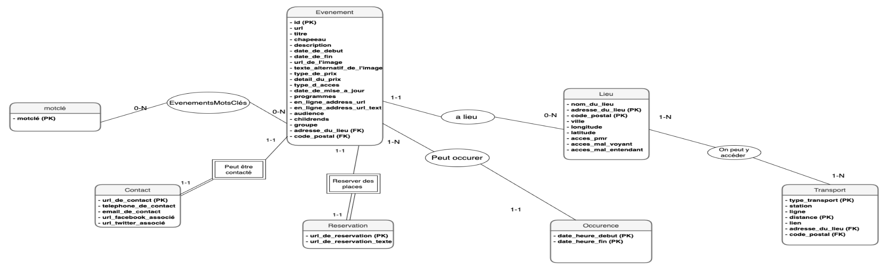

# Que Faire à Paris ? — Database Project

## Overview
This project covers the end‑to‑end design and implementation of a relational database built from the City of Paris “Que faire à Paris ?” open data. Delivered components include:  

1. **Table Creation** (`tables.sql`):  
   • SQL DDL for all tables, columns, data types, primary/foreign keys, and constraints  

2. **Anomaly Detection** (`anomalies.sql`):  
   • SQL queries highlighting inconsistent or malformed records  
   • Explanatory prompts for each check  

3. **Data Queries** (`data.sql`):  
   • Parameterized `PREPARE` statements and sample `\prompt` calls  
   • Typical lookup queries showcasing how to retrieve and filter the data  

## Data Source
- OpenData Paris “Que faire à Paris ?” dataset:  
  https://opendata.paris.fr/explore/dataset/que-faire-a-paris-/

## Prerequisites
- PostgreSQL (or any SQL database with psql client)  
- Ability to run `psql` and execute `.sql` scripts  

## Entity–Relation Schema

